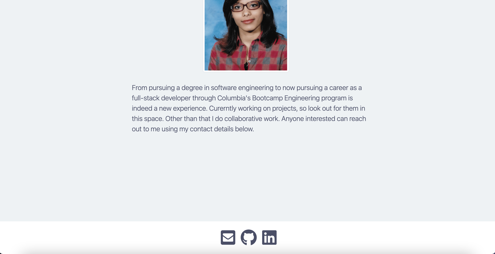

# react-portfolio


[](https://opensource.org/licenses/MIT)


## Table of Contents
- [Description](#Description)
- [Screenshots](#Screenshots)
- [User Story](#User-Story)
- [Acceptance Criteria](#Acceptance-Criteria)
- [Deployed Application URL](#Deployed-Application-URL)


## Description 


## Screenshots




## User Story 
```
```


## Acceptance Criteria
```
```


## Deployed Application URL 
[React Portfolio]()