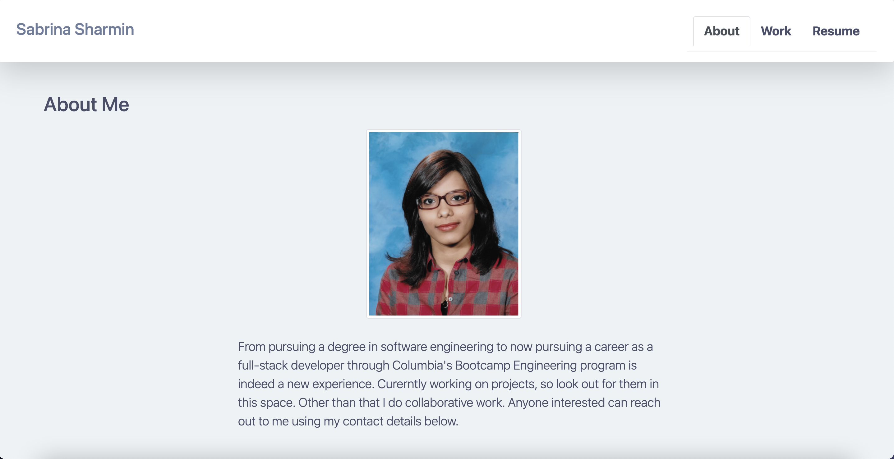

# react-portfolio

[](https://opensource.org/licenses/MIT)

## Table of Contents

- [Description](#Description)
- [Screenshots](#Screenshots)
- [Requirements](#Requirements)
- [Deployed Application URL](#Deployed-Application-URL)

## Description

A portfolio is a great way to showcase skills and talents to employers. It gives a quick access to all your work in once place, which can be used as a reference anytime. This assignment required to build my portfolio using react. Though initially challenging but I thoroughly enjoyed building the react portfolio app.

## Screenshots




## Requirements

```
* Updated portfolio featuring 6 total projects

* Use React

* A `Header` component that appears on multiple pages

* A single `Project` component that will be used multiple times on a single page

* Navigation with React Router, dynamic rendering, or another third part router

* A `Footer` component that appears on multiple pages

* Update GitHub profile with pinned repositories featuring those same projects

* Deploy this site to GitHub Pages using the [Create React App docs for deployment.](https://create-react-app.dev/docs/deployment/#github-pages)
```

## Deployed Application URL

[React Portfolio](https://react-portfolio-app-deployed.herokuapp.com/)
